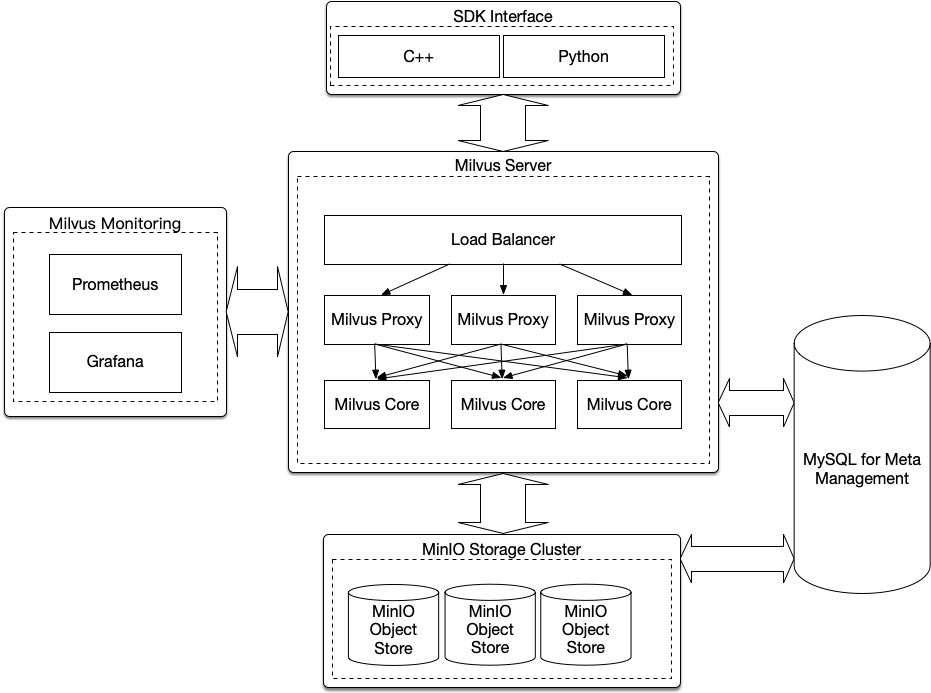
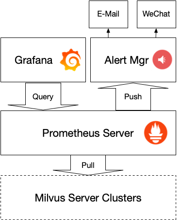
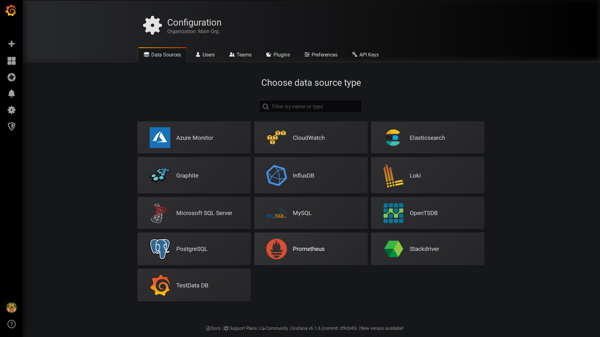
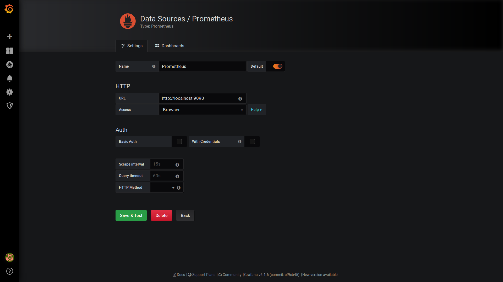
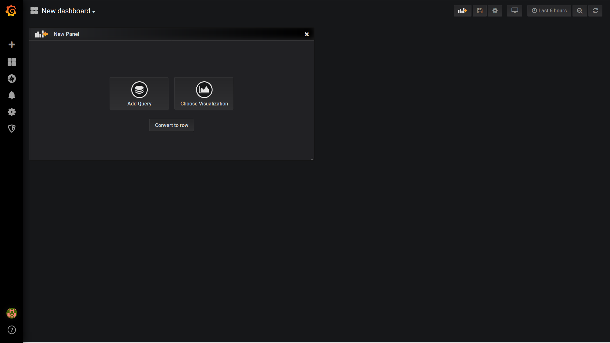
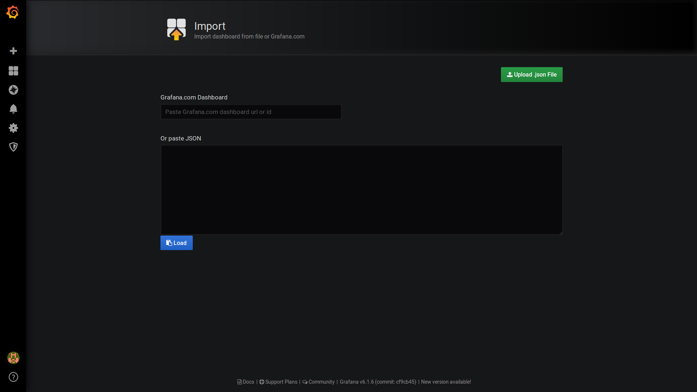
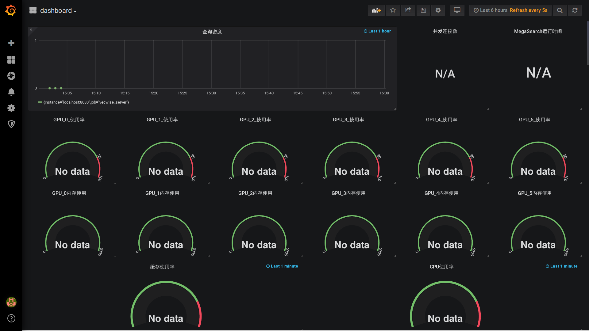

# Milvus用户指南

## Milvus简介

### 我们为什么创建Milvus

在回答为什么创建Milvus这个问题之前，有必要对几个核心概念进行必要解释：

#### 特征向量

现实世界的事物，复杂而多元，通常是很难使用少数几个简单数能精确描述的。因此，我们会使用特征向量来精确描述一个事物，特征向量就是现实事物的数学抽象。现在的人工智能技术核心能力，就是利用各种计算机算法对现实世界的原始数据进行特征提取，特征处理和特征选择，最终形成准确描述该事物的特征向量。

#### 特征向量检索数据库

随着机器学习和深度学习技术越来越成熟，应用越来越广泛，随之而产生的特征向量数据也会越来越庞大，但目前看来，传统的数据库系统和大数据系统并不能满足海量特征向量检索的要求。原因有以下几方面：

1. 传统的数据库系统和大数据系统，其内建数据类型里并不包括特征向量类型。

   如果打算使用传统的数据库系统进行特征向量检索，要么自定义特征向量类型，以及针对该类型数据的自定义函数；要么就只能按照一维一列的方式把高维向量存入数据库系统。由于大多数数据库系统对于表列数的支持都是有限的，使用这种方法通常无法支持高维特征向量。

2. 传统的数据库和大数据系统里，除了没有针对该数据类型的存储方式、计算方法，也没有针对该类型的索引方式和数据的管理方式。

综上所述，使用传统的数据库和大数据系统进行特征向量的存储和检索，都是不合适的。提供一个面向海量特征向量检索的数据库系统，已经是市场对于数据库厂商提出的新需求。这也是Milvus应运而生的主要原因。


### Milvus是什么

Milvus是Zilliz公司针对AI应用大规模落地，当前工业界并没有一款成熟向量检索系统，而研制的面向海量特征向量检索的数据库系统，旨在帮助用户实现非结构化数据的近似检索和分析。其实现原理是通过AI算法提取非结构化数据的特征，然后利用特征向量唯一标识该非结构化数据，最后用向量间的距离衡量非结构化数据之间的相似度。


### 产品特性

Milvus产品特性主要包含以下：

- 高速智能向量检索 

  使用CPU/GPU异构计算引擎，提供高准确度的百亿向量检索，检索结果的秒级响应。

- 水平线性弹性扩展

  可随着业务增长而伸缩，只需要通过增加更多的机器来满足业务增长需要。

- 高可用

  内部计算、存储和元数据集群，均允许部分实例失效，而不影响整个集群的可用性。　

- 支持实时插入

  与很多面向向量检索的算法要求不同，Milvus支持对于特征向量的实时插入，支持边插入数据边查询数据。

- 高易用性

  提供了基于C++/Python的客户端SDK。对于其他类型的语言，Milvus支持通过RESTful和RPC的访问方法。

- 易部署

  云数据库，支持公有云、私有云和混合云，使部署、配置和维护变得十分简单。

- AI模型全支持

  支持目前所有AI训练框架所训练的模型所产生的特征向量，涵盖图片、视频、文本、语音等等方面。

- 跨平台

  可以运行在Linux和Windows平台上，支持x86/ARM/PowerPC等架构，为边缘计算应用提供基础支撑。

- 可视化监控

  提供基于Prometheus的监控和Grafana的可视化展示。


### 系统架构



Milvus系统由四部分组成：

- Milvus Server

  负责接收客户端发送的请求。收到请求后，Load Balancer负责把请求发送到负载较小的Milvus Proxy。Milvus Proxy会根据查询向量表的元数据，分发任务到不同的Milvus Core做计算。当所有的Milvus Core都计算结束后，Mivlus Proxy负责合并所有的结算结果，并返回给客户端。

- Storage Cluster

  负责提供强一致和高可靠的数据存储，目前该集群是基于MinIO对象存储搭建的。

- Meta Management

  负责提供Milvus集群和存储集群的元数据管理，目前是基于MySQL实现的。

- Milvus Monitoring

  Milvus使用开源时序数据库Prometheus作为监控和性能指标信息存储方案，使用Grafana作为可视化组件进行展示。


## Milvus安装

### Milvus Docker版安装前提条件

Milvus是一款面向向量检索的数据库系统，可以很好的运行和部署在x86架构的服务器环境和主流的虚拟化环境下，也支持目前主流的网络硬件设备。操作系统方面，Milvus支持目前主流的Linux操作系统环境。

- Linux操作系统版本要求

| Linux 操作系统平台       | 支持版本        |
| :----------------------- | :---------- |
| Red Hat Enterprise Linux | 7.5及以上   |
| CentOS                   | 7.5及以上   |
| Ubuntu LTS               | 16.04及以上 |

- 典型硬件配置要求

| 硬件名称 | 硬件要求         |
| -------- | ---------------- |
| CPU      | 16核+            |
| GPU      | Pascal系列及以上 |
| 内存     | 256GB及以上      |
| 硬盘类型 | SSD或者NVMe      |
| 网络     | 万兆网卡         |

- 客户端浏览器要求

Milvus 提供了基于Prometheus监控和Grafana的展示平台，可以对数据库的各项指标进行可视化展示，兼容目前主流的Web浏览器如：微软IE、Google Chrome、Mozilla Firefox和Safari等。

- 软件包安装要求

请确保你已经安装以下软件包，以便Milvus Docker版能正常运行：

- [CUDA 9.0及以上](https://docs.nvidia.com/cuda/cuda-installation-guide-linux/index.html)
- [Docker CE](https://docs.docker.com/install/)
- [NVIDIA-Docker2](https://github.com/NVIDIA/nvidia-docker)


### Milvus安装

关于Milvus具体安装步骤，请参照 [Milvus Quick Start](https://github.com/milvus-io/docs/edit/master/QuickStart-cn.md)。


## Milvus配置

在成功安装Milvus后，请进入Milvus Docker镜像文件进行相关配置。目前Milvus的Docker版配置包含以下几种：

### Milvus服务配置

点击server_config文件，并配置以下参数：

- address：目前Milvus server监听的ip地址。 
- port：目前Milvus server监听的端口号。
- transfer_protocol：Milvus client与server通信的协议，可以是binary, compact或json。 
- server_mode：目前支持simple（单线程）和thread_pool（线程池）两种模式。 
- gpu_index：目前使用的GPU。

### Milvus数据库配置

点击db_config文件，并配置以下参数：

- db_path: Milvus数据库文件存储的路径。
- db_backend_url: 使用RESTFul API接口访问数据库的ip地址。
- db_flush_interval: 插入数据持久化的时间间隔。

### Milvus监控参数配置

点击metric_config文件，并配置以下参数：

- startup: 选择是否启动监控，on（启动）或off（不启动）。
- collector: 连接的监控系统，目前支持prometheus。
- prometheus_config（promethus监控相关配置）：
  - collect_type: prometheus的监控获取方式，支持pull或push方式。
  - port: 访问prometheus的端口号。
  - push_gateway_ip_address: push gateway的ip地址，push方式有效。
  - push_gateway_port: push gateway的端口号，push方式有效。
  
  

## Milvus监控

### 概述

Milvus的监控系统是基于开源监控框架Prometheus搭建的。目前，Milvus server收集数据后，利用pull模式把所有数据导入Prometheus，然后通过Grafana展示所有监控指标。一旦发生告警，Prometheus会将告警信息可以推送给AlertManager，并通过Email或者WeChat通知用户。告警系统架构如下：



Grafana是一个开源的指标分析及可视化系统。我们使用Grafana来展示Milvus的各项系统指标，如下图：


### 如何使用Prometheus和Grafana监控Milvus

1. 安装Prometheus和Grafana。

   - [安装Prometheus Server](https://github.com/prometheus/prometheus#install)

   - [安装Grafana](http://docs.grafana.org)


2. 配置Prometheus。

   1) 打开prometheus根目录下的prometheus.yml配置文件，并将alerting, rule_files和scrape_configs更新如下：
   
   ```yaml
   # my global config
   global:
     scrape_interval:     15s # Set the scrape interval to every 1 seconds. Default is every 1 minute.
     evaluation_interval: 15s # Evaluate rules every 15 seconds. The default is every 1 minute.
     # scrape_timeout is set to the global default (10s).

   # Alertmanager configuration
   alerting:
     alertmanagers:
     - static_configs:
       - targets: ['localhost:9093']

   # Load rules once and periodically evaluate them according to the global 'evaluation_interval'.
   rule_files:
      - "serverdown.yml" # add alerting rules

   # A scrape configuration containing exactly one endpoint to scrape:
   # Here it's Prometheus itself.
   scrape_configs:
     # The job name is added as a label `job=<job_name>` to any timeseries scraped from this config.
     - job_name: 'prometheus'

       # metrics_path defaults to '/metrics'
       # scheme defaults to 'http'.

       static_configs:
       - targets: ['localhost:9090']
  
  	# scrape metrics of server
     - job_name: 'milvus_server'
       scrape_interval: 1s
       static_configs:
       - targets: ['localhost:8080']
    
  	   # under development
     - job_name: 'pushgateway'
       static_configs:
       - targets: ['localhost:9091']
   ```
   2) 在prometheus根目录下创建serverdown.yml文件，内容如下：

   ```yaml
   groups:
   - name: milvus
     rules:
       - alert: MilvusServerDown
         expr: up{job="milvus_server"}
         for: 1s
         labels:
           serverity: page
   ```

3. 配置alertmanager
   1) 在alertmanager根目录下创建 milvus.yml文件，内容如下：

   ```
   global:
     resolve_timeout: 1m
     smtp_smarthost: 'smtp.163.com:25' # smtp server config
     smtp_from: '×××@163.com'          # sender mail account
     smtp_auth_username: '×××@163.com' # sender mail account
     smtp_auth_password: '××××××××'    # sender mail password
     smtp_hello: '163.com'             # sender mail suffix
     smtp_require_tls: false
   route:
     group_by: ['alertname']
     receiver: default

   receivers:
     - name: 'default'
       email_configs:
       - to: '××××@××.com'             # receiver mail address
   ```
   2) 指定--config.file=milvus.yml以启动alertmanager，如下：

   ```
   ./alertmanager --config.file=milvus.yml
   ```

4. 配置Grafana

   1) 打开terminal，执行以下命令
   
   ```
   $ docker run -i -p 3000:3000 grafana/grafana
   ```
   
   2) 登录Grafana网页(localhost:3000)，在data source type选项框选择Prometheus。
   
   
   
   3) 在HTTP区域，将URL设置成Prometheus的服务器地址http://localhost:9090, 将ACCESS设置成Browser，点击Save & Test。
   
   
   
   4) 点击页面左上角的New dashboard。
   
   
   
   5) 点击右侧的Import dashboard。
   
   
   
   6) 下载json配置文件，并将其导入系统。
   
   

   成功之后，将会出现我们提供的监控面板：
   
   


恭喜你！你已经完成了Milvus的所有安装配置，现在可以使用Milvus试运行一条向量相似度查询了。


## 常见问题

- Milvus是什么？

  Milvus是一款面向向量检索的数据库系统，可以很好的运行和部署在x86架构的服务器环境和主流的虚拟化环境下，也支持目前主流的网络硬件设备。操作系统方面，Milvus支持目前主流的Linux操作系统环境。

- Milvus能够使用的接口有哪些？

  目前Milvus提供Python和C++的SDK接口，同时还支持所有基于Thrift的通信方式。

- Milvus的易用性如何？

  Milvus的使用非常简单。可以把Milvus当作普通的数据库系统，具体参考前文提供的样例程序和https://pypi.org/project/pymilvus/ 。

- Milvus具备高可用特性吗？

  Milvus集群具备高可用性，其存储和计算等集群均容许部分组件失效，而不影响整个集群的使用。

- 向量存入Milvus后，如何检索？

  向量存入Milvus后，Milvus会给对应向量一个ID，用户需要自己将该向量ID和其对应的其他属性存入另外一个数据库系统。查询的时候，用户提供需要查询的向量，Milvus会返回和用户提供向量最匹配的数个向量的ID以及匹配度。

- 如何选择向量索引的类型？

  依据用户的需求，如果用户需求精确匹配，那么请选择L2Flat类型索引。精确匹配，可以为用户提供100%精确匹配的向量，但是由于计算量巨大，性能影响也很大。如果用户不追求100%精确匹配，可以选择IVFFlat类型索引，支持大数据量的高精度匹配。

- Milvus是否支持边插入边查询的能力？

  支持。


## 技术支持

- 如果你有任何问题和建议，请联系邮箱：support@zilliz.com

- 对于有企业合作的用户，请拨打客服电话：400 …..


#### 路线图

- 支持存储结构化数据和非结构化数据，也支持针对结构化和非结构化数据的混合查询。

- 提供基于Java的SDK
- 提供基于图形化和命令行管理工具
- 提供云端的PaaS部署
- 支持强一致性存储
- 提供对于事务的支持
- 提供给定向量ID的检索
- 提供更多种索引类型的支持
- 使用基于ETCD集群的元数据管理
