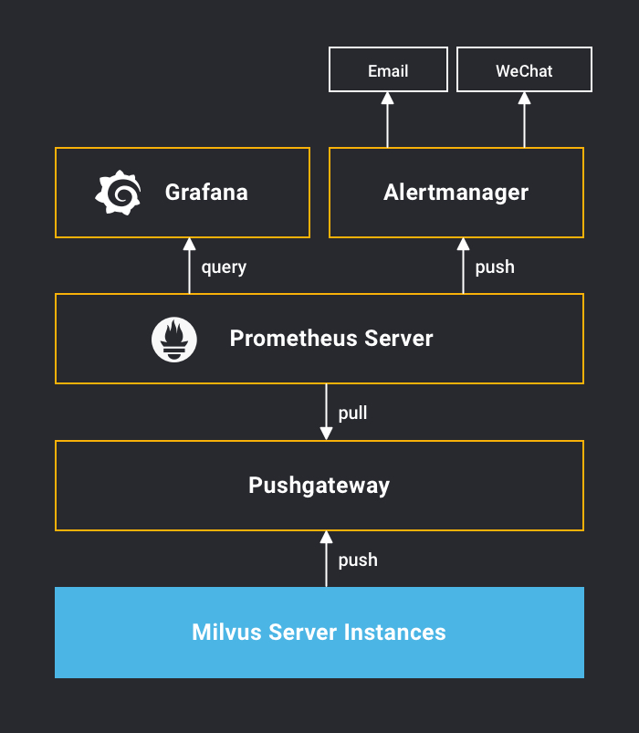

# 监控与报警

## 概述

尽管 Milvus 可用性高，我们仍然需要对生产系统进行积极全面的性能监控，以及给需要调查干预的突发情况创建报警规则以触发用户通知。

### 监控系统

Milvus 使用 Prometheus 作为监控和性能指标存储方案，使用 Grafana 作为可视化组建进行数据展示。

- Prometheus

  Prometheus 是一个拥有多维度数据模型、灵活的查询语句的监控报警系统。

  Prometheus 提供多个组件供用户使用。目前，Milvus 使用了以下组件：

  - Prometheus Server：用于收集和存储时间序列数据。
  - Client 代码库：用于定制程序中需要的 metric。
  - Alertmanager：用于实现报警机制。
  - Pushgateway：使生命周期短、批量的 metric 能够被 Prometheus 提取。这些 metric 本身是难以及时提取的。

其工作流程如下图所示:



- Grafana

  Grafana 是一个开源的时序数据分析及可视化平台。Milvus 使用 Grafana 来展示各项性能指标：

  


### 需要报警的事件

积极的监控帮助及早发现问题，但创建报警规则以便在出现突发事件时触发用户通知也非常有必要。

以下主要介绍需要创建报警规则的事件。

**服务器宕机**

- 报警规则：当 Milvus 服务器宕机时发送报警信息。
- 如何判断：当 Milvus 服务器宕机时，监控仪表盘上各个指标会显示 **No Data**。

**CPU/GPU 温度过高**

- 报警规则：当 CPU/GPU 温度超过 80 摄氏度时发送报警信息。
- 如何判断：查看监控仪表盘上的 `CPU Temperature` 和  `GPU Temperature` 两个指标。

## 使用 Prometheus 和 Alertmanager

Milvus 会生成详细的关于系统运行状态的时序 metrics。该页面向您展示如何利用 [Prometheus](https://prometheus.io/) 提取收集这些 metrics，如何将 [Grafana](https://grafana.com/) 和 [Alertmanager](https://prometheus.io/docs/alerting/alertmanager/) 连接到 Prometheus 实现数据可视化的展示和报警机制。

### 前提条件

- 请确保您已经启动了 Milvus 服务。
- 请确保您已经启用了 Milvus 的监控功能。

### 安装 Prometheus

1. 下载 [Prometheus tarball](https://prometheus.io/download/) 。

2. 确保 Prometheus 已经成功安装：

   ```shell
   $ prometheus --version
   ```

   > 建议：您可以提取 Prometheus binary 并添加到 `PATH` ，以便在任意 Shell 上都能快速启动 Prometheus。

### 设置 Prometheus

1. 下载 Milvus [Prometheus 配置文件](https://github.com/milvus-io/docs/blob/v0.7.0/assets/monitoring/prometheus.yml) 。

   ```shell
   $ wget https://raw.githubusercontent.com/milvus-io/docs/v0.7.0/assets/monitoring/prometheus.yml \ -O prometheus.yml
   ```

2. 根据您的需求编辑配置文件。参考 [https://prometheus.io/docs/prometheus/latest/configuration/configuration/](https://prometheus.io/docs/prometheus/latest/configuration/configuration/) 了解更多关于 Prometheus 配置文件的信息。

   > 注意：如果您使用了分布式集群，则需要在 `job_name = 'milvus_server'` 下的 `targets` 字段，为集群中的每个节点分布添加相应的 `localhost: <http-port>` 。

3. 下载 Milvus [报警规则文件](https://github.com/milvus-io/docs/blob/v0.7.0/assets/monitoring/alert_rules.yml) 到 Prometheus 根目录。

   ```shell
   wget -P rules https://raw.githubusercontent.com/milvus-io/docs/v0.7.0/assets/monitoring/alert_rules.yml
   ```

### 启动 Prometheus

1. 启动 Prometheus 服务， `--config.file` 指向配置文件：

   ```shell
   $ ./prometheus --config.file=prometheus.yml
   ```

2. 将浏览器指向 `http://<hostname of machine running prometheus>:9090` ，进入 Prometheus 用户交互页面。

### 安装并启动 Pushgateway

参考 [https://github.com/prometheus/pushgateway](https://github.com/prometheus/pushgateway) 了解如何下载和启动 Pushgateway。

### 使用 Grafana 实现 metrics 可视化展示

1. 使用以下命令安装并运行 Grafana：

   ```
   $ docker run -i -p 3000:3000 grafana/grafana
   ```

2. 将浏览器指向 `http://<hostname of machine running grafana>:3000` ，使用默认的用户名/密码，`admin/admin`，登录 Grafana 用户交互页面。您也可以在此创建新的 Grafana 账号。

3. [添加 Prometheus 作为 data source](https://grafana.com/docs/grafana/latest/features/datasources/prometheus/).

4. 对 data source 做如下设置：

   | Field   | Definition                                             |
   | :------ | :----------------------------------------------------- |
   | Name    | Prometheus                                             |
   | Default | True                                                   |
   | URL     | `http://<hostname of machine running prometheus>:9090` |
   | Access  | Browser                                                |

5. 下载 [Grafana 配置文件](https://github.com/milvus-io/docs/blob/v0.7.0/assets/monitoring/dashboard.json) :

   ```shell
   $ wget https://raw.githubusercontent.com/milvus-io/docs/v0.7.0/assets/monitoring/dashboard.jsonr
   ```

6. [将配置文件导入 Grafana](http://docs.grafana.org/reference/export_import/#importing-a-dashboard).

### 使用 Alertmanager 发送通知

在 Prometheus 配置，您已经下载了 Milvus 的报警规则文件。现在，您只需要下载、配置并启动 Alertmanager。

1. 下载 [最新 Alertmanager tarball](https://prometheus.io/download/#alertmanager) 。

2. 确保 Alertmanager 已经成功安装：

   ```shell
   $ alertmanager --version
   ```

   > 建议：您可以提取 Alertmanager binary 并添加到 `PATH` ，以便在任意 Shell 上都能快速启动 Alertmanager。

3. 创建 [Alertmanager 配置文件](https://prometheus.io/docs/alerting/configuration/) 来指定接受报警通知的邮箱/微信账户，并将配置文件添加到 Alertmanager 根目录下。

4. 启动 Alertmanager 服务， `--config.file` 指向配置文件：

   ```shell
   alertmanager --config.file=simple.yml
   ```

5. 将浏览器指向 `http://<hostname of machine running alertmanager>:9093` ，进入 Alertmanager 用户交互页面。您可以在此定义 [muting alerts](https://prometheus.io/docs/alerting/alertmanager/#silences) 的条件。

## 相关阅读

[监控指标](../reference/monitoring_metrics.md)
