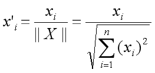

{{fragments/metrics.md}}
{{tab}} 

<table class="tg">
<thead>
  <tr>
    <th class="tg-0pky">距离计算方式</th>
    <th class="tg-0pky">索引类型</th>
  </tr>
</thead>
<tbody>
  <tr>
    <td class="tg-0pky">欧氏距离 (L2)</td>
    <td class="tg-0pky" rowspan="2"><ul><li>FLAT</li><li>IVF_FLAT</li><li>IVF_SQ8</li><li>IVF_SQ8H</li><li>IVF_PQ</li><li>RNSG</li><li>HNSW</li></ul></td>
  </tr>
  <tr>
    <td class="tg-0pky">内积 (IP)</td>
  </tr>
</tbody>
</table>

### 欧氏距离（L2）

欧氏距离计算的是两点之间最短的直线距离。

欧氏距离的计算公式为：

其中 **a** = (a1, a2,..., an) 和 **b** = (b1, b2,..., bn) 是 n 维欧氏空间中的两个点。

欧氏距离是最常用的距离计算方式之一，应用广泛，适合数据完整，数据量纲统一的场景。

### 内积 （IP）

两条向量内积距离的计算公式为：

假设有 A 和 B 两条向量，则 `||A||` 与 `||B||` 分别代表 A 和 B 归一化后的值。

内积更适合计算向量的方向而不是大小。

如需使用点积计算向量相似度，则必须对向量作归一化处理。处理后点积与余弦相似度等价。

假设 X' 是向量 X 的归一化向量：

两者之间的关系为：

## 常见问题

为什么向量距离计算方式是内积时，搜索出来的 top1 不是目标向量本身？

{{fragments/faq_top1_not_target.md}}

什么是归一化？Milvus 中为什么有时候需要归一化？

{{fragments/faq_normalize_embeddings.md}}

为什么欧氏距离和内积在计算向量相似度时的结果不一致？

{{fragments/faq_euclidean_ip_different_results.md}}

