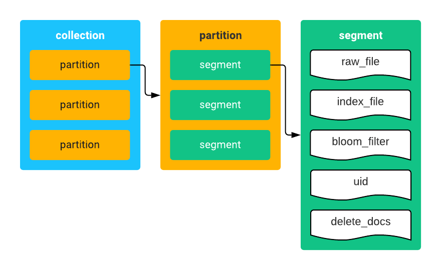

# 存储相关概念

## 分区和数据段 

建立集合时，Milvus 根据参数 `index_file_size` 控制数据段的大小。另外，Milvus 提供分区功能，你可以根据需要将数据划分为多个分区。对数据的合理组织和划分可以有效提高查询性能。

#### 数据段（segment）

为了能处理海量的数据，Milvus 会将数据分段，每段数据拥有数万甚至数十万个实体。每个数据段的数据又按照字段（field）分开，每个字段的数据单独存为一个数据文件。目前的版本中，实体仅包含一个 ID 字段和一个向量字段，因此每个数据段的数据文件主要包括一个 UID 文件以及一个原始向量数据文件。

数据段的大小是由创建集合时的参数 `index_file_size` 来决定的，默认为 1024 MB，上限为 4096 MB。
  
建立索引时，集合中的每个数据段依次建立索引，并将索引单独存为一个文件。索引文件之间相互独立。索引可以显著地提高检索性能。

#### 分区（partition）

当一个集合累积了大量数据之后，查询性能会逐渐下降。而某些场景只需查询集合中的部分数据，这时就要考虑把集合中的数据根据一定规则在物理存储上分成多个部分。这种对集合数据的划分就叫分区。每个分区可包含多个数据段。
  
分区以标签（tag）作为标识。插入向量数据时，你可以指定将数据插入到某个标签对应的分区中。查询向量数据时，你可以根据标签来指定在某个分区的数据中进行查询。Milvus 既支持对分区标签的精确匹配，也支持正则表达式匹配。

每个集合的分区数量上限是 4096 个。

#### 集合、分区和数据段的关系

集合、分区以及数据段的关系如下所示：

每个集合都有一个 <code>_default</code> 分区。插入数据时如果没有指定分区，Milvus 会将数据插入该分区中。

## 元数据
   
不管是分区还是段，都只是数据在物理存储中的组织形式。Milvus 进行查询操作时，必须要获知各个数据文件在物理存储上的位置以及状态信息，包括所属集合、包含的实体条数、文件的大小、全局唯一的标识、以及创建日期等等。我们将这些信息称为元数据。此外，元数据还包含集合以及分区的信息，包括集合名称、集合维度、索引类型、分区标签等等。
    
当数据发生改变时，元数据应相应变化并且易于获取，因此使用事务型数据库来管理元数据是一个理想的选择。Milvus 提供 SQLite 或者 MySQL 作为元数据的后端服务。对于生产环境或者分布式服务来说，应当使用 MySQL 来作为元数据后端服务。

元数据后端服务不负责存储实体数据和索引。

## 常见问题

Milvus 的元数据存储可以使用 SQL Server 或者 PostgreSQL 吗？

{{fragments/faq_supported_meta_db.md}}

